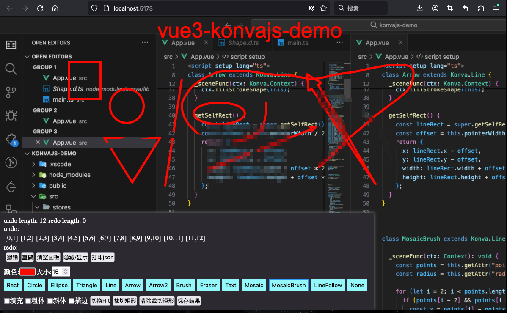

# Vue 3 + TypeScript + Vite + Konvajs

一个Konvajs 画板demo

## 功能支持
- 撤销
- 重做
- 清空
- 设置颜色
- 设置大小(滚轮)
- 填充
- 粗体
- 斜体
- 描边
- 裁切
- 保存(下载)
### 形状
- 矩形
- 圆形
- 椭圆
- 三角形
- 线条 (支持shift 固定角度)
- 箭头  (支持shift 固定角度)
- 箭头2  (支持shift 固定角度)
- 画笔
- 文本
- 马赛克块
- 马赛克画笔

## 预览


## 运行
```bash
git clone 
cd 
yarn install
yarn dev
```


